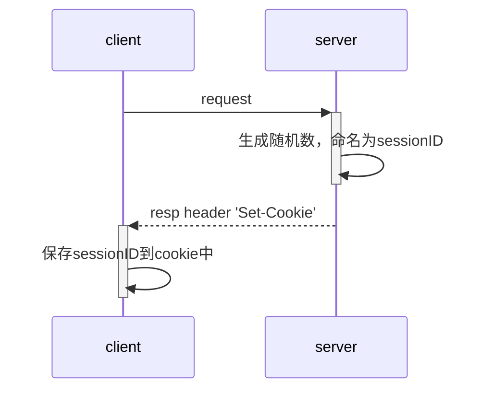

## cookie  

### cookie 是什么

由于**HTTP是一种无状态的协议**，服务器单从网络连接上是无法知道客户身份的。这时候服务器就需要给客户端颁发一个cookie，用来确认用户的身份。

简单的说，cookie 就是客户端保存用户信息的一种机制，用来记录用户的一些信息。

>原理: web 服务器通过在 http 响应消息头增加 Set-Cookie 响应头字段将 Cookie 信息发送给浏览器，浏览器则通过在 http 请求消息中增加 Cookie 请求头字段将 Cookie 回传给 web 服务器。

### cookie 构成
**服务器端**向**客户端**发送 Cookie 是通过 HTTP 响应报文实现的，在 Set-Cookie 中设置需要向客户端发送的 cookie，cookie 格式如下：
```text
Set-Cookie: "name=value;domain=.domain.com;path=/;expires=Sat, 11 Jun 2019 11:29:42 GMT;HttpOnly;secure"
```
其中 name=value 是必选项，其它都是可选项。Cookie 的主要构成如下：

- name: 一个唯一确定的 cookie 名称。通常来讲 cookie 的名称是不区分大小写的。
- value: 存储在 cookie 中的字符串值。**最好为 cookie 的 name 和 value 进行 url 编码**
- domain: cookie 对于哪个域是有效的。所有向该域发送的请求中都会包含这个 cookie 信息。这个值可以包含子域 (如：[http://e.baidu.com](http://e.baidu.com/))，也可以不包含它 (如：. [http://baidu.com](http://baidu.com/)，则对于 [http://baidu.com](http://baidu.com/) 的所有子域都有效)。
- path: 表示这个cookie影响到的路径，浏览器跟会根据这项配置，像指定域中匹配的路径发送cookie。
- expires:失效时间，表示cookie何时应该被删除的时间戳(也就是，何时应该停止向服务器发送这个cookie)。如果不设置这个时间戳，浏览器会在页面关闭时即将删除所有cookie；不过也可以自己设置删除时间。这个值是GMT时间格式。**如果客户端和服务器端时间不一致，使用expires就会存在偏差。并且如果给cookie设置一个过去的时间，浏览器会立即删除该cookie**
- max-age: 与expires作用相同，用来告诉浏览器此cookie多久过期（单位是秒），而不是一个固定的时间点。正常情况下，max-age的优先级高于expires。
- HttpOnly: 告知浏览器不允许通过脚本document.cookie去更改这个值，同样这个值在document.cookie中也不可见。但在http请求张仍然会携带这个cookie。注意这个值虽然在脚本中不可获取，但仍然在浏览器安装目录中以文件形式存在。这项设置通常在服务器端设置。
-   secure: 安全标志，指定后，只有在使用 SSL 链接时候才能发送到服务器，如果是 http 链接则不会传递该信息。

>这里强调一点，是**cookie 的不可跨域名性**
>很多网站都会使用 cookie，不同浏览器采用不同的方式保存 Cookie，而且每个网站的 Cookie 只能够被对应的网站使用。意思就是说当浏览器访问 Baidu 时，只会带 Baidu 的 cookie，而不会带其他网站的 Cookie，这就是 Cookie 的不可跨域名性。 Cookie 在客户端是由浏览器来管理的。浏览器可以保证各个网站只能操作各个网站的 Cookie，从而保证用户的隐私安全。

cookie 并不提供修改、删除操作

如果要修改某个Cookie，只需要新建一个同名的Cookie，添加到response中覆盖原来的Cookie。

如果要删除某个Cookie，只需要新建一个同名的Cookie，并将maxAge设置为0，并添加到response中覆盖原来的Cookie。**注意是0而不是负数。负数代表其他的意义。**

**注意：修改、删除 Cookie 时，新建的 Cookie 除 value、maxAge 之外的所有属性，例如 name、path、domain 等，都要与原 Cookie 完全一样。否则，浏览器将视为两个不同的 Cookie 不予覆盖，导致修改、删除失败。**

## session

### session 是什么

Session 是另一种记录客户状态的机制，不同的是 Cookie 保存在客户端浏览器中，而 Session 保存在服务器上。客户端浏览器访问服务器的时候，服务器把客户端信息以某种形式记录在服务器上。

客户端浏览器再次访问时只需要从该 Session 中查找该客户的状态就可以了

### session 的工作步骤

因为HTTP协议是无状态的，Session不能依据HTTP连接来判断是否为同一个用户。于是乎：服务器向用户浏览器发送了一个名为JESSIONID的Cookie，它的值是Session的id值。其实Session依据Cookie来识别是否是同一个用户。

简单来说：Session 之所以可以识别不同的用户，依靠的就是Cookie，**所以说session是基于cookie的**

该 Cookie 是服务器自动颁发给浏览器的，不用我们手工创建的。该 Cookie 的 maxAge 值默认是-1，也就是说仅当前浏览器使用，不将该 Cookie 存在硬盘中，并且各浏览器窗口间不共享，关闭浏览器就会失效。
1. 产生 sessionID：client **第一次**访问 server，server 生成一个随机数，命名为 sessionID，并将其放在响应头里，以 cookie 的形式返回给 client，client 以处理其他 cookie 的方式处理这段 cookie。大概是这样：cookie：sessionID=135165432165



2. 保存 sessionID： server 将要保存的数据保存在相对应的 sessionID 之下，再将 sessionID 保存到服务器端的特定的保存 session 的内存中（如一个叫 session 的哈希表）
3. 使用 session： client 再次访问 server，会带上首次访问时获得的值为 sessionID 的 cookie，server 读取 cookie 中的 sessionID，根据 sessionID 到保存 session 的内存寻找与 sessionID 匹配的数据，若寻找成功就将数据返回给 client

### session 的有效期

Session 保存在服务器端。为了获得更高的存取速度，服务器一般把 Session 放在内存里。每个用户都会有一个独立的 Session。如果 Session 内容过于复杂，当大量客户访问服务器时可能会导致内存溢出。因此，Session 里的信息应该尽量精简。

Session 生成后，只要用户继续访问，服务器就会更新 Session 的最后访问时间，并维护该 Session。用户每访问服务器一次，无论是否读写 Session，服务器都认为该用户的 Session“活跃（active）”了一次。

由于会有越来越多的用户访问服务器，因此 Session 也会越来越多。为防止内存溢出，服务器会把长时间内没有活跃的 Session 从内存删除。这个时间就是 Session 的超时时间。如果超过了超时时间没访问过服务器，Session 就自动失效了。

## cookie 与 session 的区别

- Cookie数据存放在客户端，Session数据放在服务器端
- Cookie的安全性一般，他人可通过分析存放在本地的Cookie并进行Cookie欺骗。在安全性第一的前提下，选择Session更优。重要交互信息比如权限等就要放在Session中，一般的信息记录放Cookie中
- 单个Cookie保存的数据不能超过4K，很多浏览器都限制一个站点最多保存20个Cookie，而Session原则上没有限制
- Session会在一定时间内保存在服务器上。当访问增多，会比较占用你服务器的性能考虑到减轻服务器性能方面，应当使用Cookie。
- Session 的运行依赖 Session ID，而 Session ID 是存在 Cookie 中的，也就是说，如果浏览器禁用了 Cookie，Session 也会失效（但是可以通过其它方式实现，比如在 url 中传递 Session ID，也就是地址重写）


## localStorage

### localStorage 是什么

localStorage 是 HTML5 提供的一个 API，他本质上是一个 hash（哈希表），是一个存在于浏览器上的 hash（哈希表）。

### localStorage 的特点

- localStorage 与 HTTP 没有任何关系，所以在 HTTP 请求时不会带上 localStorage 的值
- 只有相同域名的页面才能互相读取 localStorage，**同源策略与 cookie 一致**
- 不同的浏览器，对每个域名 localStorage 的最大存储量的规定不一样，超出存储量会被拒绝。最大存 5M 超过 5M 的数据就会丢失。而 Chrome 10MB 左右
- 常用来记录一些不敏感的信息
- localStorage 理论上永久有效，除非用户清理缓存

### localStorage 使用方法

localStorage 和 sessionStorage 使用时使用相同的 API：
```text
localStorage. setItem ("key","value");	//以“key”为名称存储一个值“value”
localStorage. getItem ("key");	//获取名称为“key”的值
localStorage. removeItem ("key");	//删除名称为“key”的信息。
localStorage. clear ();	//清空 localStorage 中所有信息
```

localStorage 是一个保存于客户端的哈希表，可以用来保存本地的一些数据。并且不会因为刷新而释放，所以，可以使用 localStorage 来实现变量的持久化存储


## sessionStorage

sessionStorage 的所有性质基本上与 localStorage 一致，唯一的不同区别在于：

sessionStorage 的有效期是页面会话持续，如果页面会话（session）结束（关闭窗口或标签页），sessionStorage 就会消失。而 localStorage 则会一直存在。

## localStorage与sessionStorage的区别

- localStorage 生命周期是永久的，除非被清除，否则永久保存，而 sessionStorage 仅在当前会话下有效，关闭页面或浏览器后被清除

- **相同点可以参考 localStorage 的特点**

这里再强调一下，这两个存储方式用来存放数据大小一般为5MB，并且仅在客户端（即浏览器）中保存，不参与和服务器的通信。

